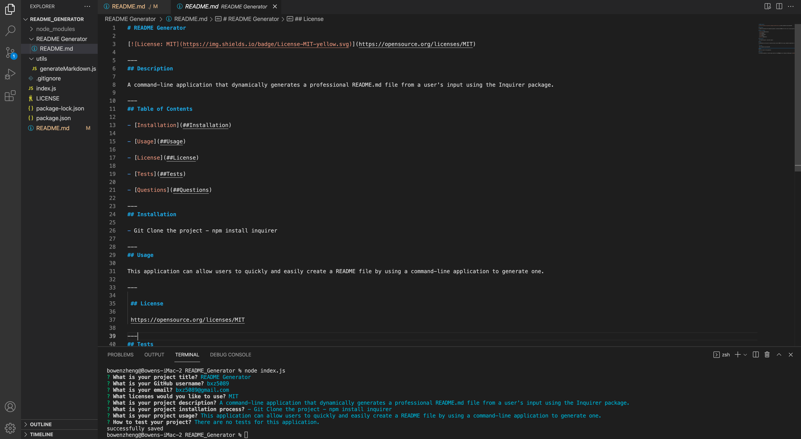

# README Generator 

---
## Description

A command-line application that dynamically generates a professional README.md file from a user's input using the Inquirer package.    

---
## Table of Contents

- [Installation](##Installation)

- [Usage](##Usage)

- [License](##License) 

- [Tests](##Tests)

- [Questions](##Questions)

---
## Installation

- First, use git clone in the terminal to download the project 
- Then open the project in VS Code and in the package.json folder enter the terminal 
- Within the terminal, use npm install inquirer to install the inquirer package
- The command-line application should work when node index.js is entered in the terminal 

---
## Usage

This application can allow users to quickly and easily create a README file by using a command-line application to generate one.

--- 
 
 ## License 
 
 https://opensource.org/licenses/MIT

---
## Tests

There are no tests for this application.

---
## Questions

If you have any questions or concerns please contact me at bxz5089@gmail.com or checkout my GitHub page at [bxz5089](https://github.com/bxz5089/).
